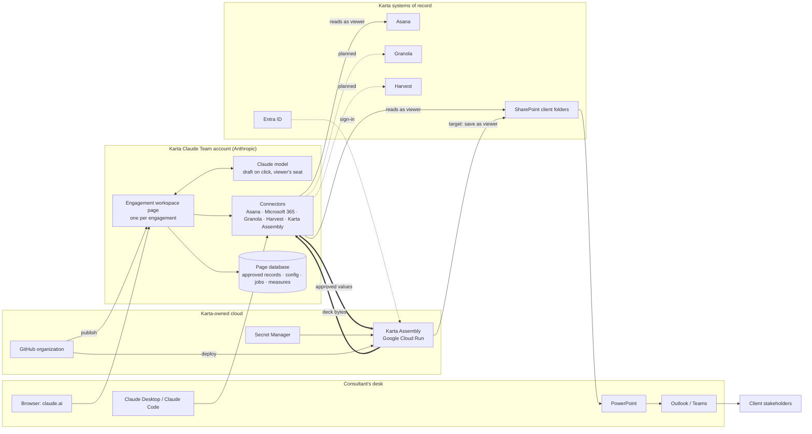
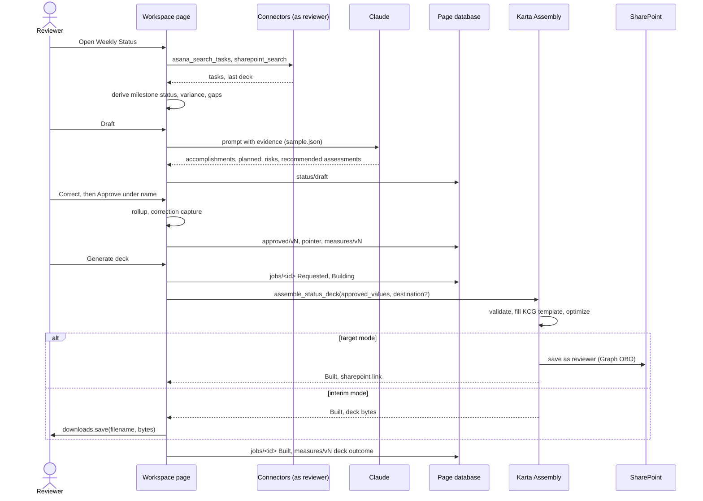

# Karta AI Engagement Workspace: Solution Design

**Version:** 1.0 draft, September 9, 2026
**Author:** Sean Bradley, AI strategy lead, with Claude
**Status:** Gates 0 to 6 closed; Gate 7 (Stage 1 Prove) in progress
**Governing record:** `handover/karta-engagement-delivery-workspace-product-design.md` (product decisions 1 to 37). This document describes how the product is built; the handover records why.

---

## 1. Purpose and scope

Every Karta engagement gets a workspace: a published page the staffed team opens each week that reads the engagement's own systems, runs the Weekly Status workflow with a named human approval, produces the client status deck through a Karta-hosted service, and keeps the approved record. AI is used for judgment (drafting narrative, suggesting a status) and never for facts that code can derive (dates, status colors, rollups, file assembly).

**In scope for the pilot (Stage 1 Prove)**

- One workspace per engagement, stood up from a blank template by a non-technical owner
- Weekly Status end to end: review sources, draft, correct, approve under a name, build the deck
- Home view: seven-stage journey, current stage, next control point, attention items, evidence and decisions
- Area views: Milestones, RAID, Decisions, Artifacts, Catalog, Config
- Ask Claude: questions answered strictly from the engagement's evidence
- Pilot measures recorded at approval and generation

**Out of scope for the pilot**

- Reads from Granola, Harvest, Outlook or a RAID log (linked in configuration, read later)
- Any automatic sending of a deck or message
- Any write to a source system other than saving the approved deck
- Client access to the workspace
- Teams embedding (not possible for published pages)

## 2. Design principles

These are product decisions and do not bend during build.

1. **Read as the viewer.** Every read of Asana, SharePoint, Granola or Harvest runs through the viewer's own claude.ai connector with their own access. No service account, no shared credential.
2. **A named person approves.** No value reaches a client deliverable without a reviewer correcting the draft and approving under their name and email.
3. **Nothing is sent automatically.** The workspace produces the deck; a person distributes it.
4. **Missing evidence is Unknown or Not assessed, never Green.** Rollups block Green when any input is Unknown.
5. **Derive in code what can be derived.** Milestone status, variance, rollup, period and file assembly are deterministic and tested. The model drafts prose and recommends.
6. **Model calls fire on an explicit click and run on the viewer's seat.** Draft once, persist, everyone reads the same values.
7. **One engagement per workspace.** No engagement switcher; isolation comes from separate pages, separate databases and separate sharing.
8. **Configuration is identifiers, links, dates and people, never client facts.**
9. **No dependency on any laptop or on the Microsoft tenant admin** beyond one consent.
10. **Observe a connector's real request and response before wiring it into a page.**

## 3. Architecture overview

### 3.1 Two runtimes

| Runtime | What it is | Runs where | Used for |
|---|---|---|---|
| **Runtime 1: engagement page** | A published claude.ai artifact page per engagement with capabilities `mcp`, `sample`, `db`, `downloads`, `artifact` | Karta's Claude Team account, opened in the viewer by a member | Home, Weekly Status, area views, Ask Claude, Config |
| **Runtime 2: member Claude session** | Skills, agent files and the Karta delivery plugin | Each member's Claude Desktop or Claude Code | Ad hoc capabilities, the same connectors and identity |

The page cannot run skills or plugins, cannot fetch arbitrary URLs, and cannot be embedded in Teams. Those are platform facts, measured in Gate 1.

### 3.2 Components

| Component | Responsibility | Technology | Location in repo |
|---|---|---|---|
| Engagement workspace page | UI, deterministic status rules (mirror of the Python module), connector reads, drafting, approval, deck job, configuration, measures, self-rename | Single HTML file, vanilla JS, no framework | `page/engagement-workspace.html` |
| Karta Assembly service | MCP server exposing `assemble_status_deck` and `whoami`; validates approved values, builds the deck, returns bytes or saves to SharePoint | Python 3.12, FastMCP 2.14.7, stateless HTTP, Docker, Cloud Run us-central1 | `server/` |
| Assembler library | Pure function: approved values plus template to `.pptx`; deterministic status module; template optimizer | Python, python-pptx; 38 tests | `assembler/karta_assembler/` |
| Contracts | JSON Schemas for approved values, deck job, engagement configuration | JSON Schema, validated in CI | `docs/contracts/` |
| Design canvas and brand | Gate 5 direction artboards, Karta K marks | `.dc.html`, PNG | `design/` |
| Documentation | Stand-up process, onboarding runbook, access test plan, Entra setup, spike notes, this design | Markdown and HTML | `docs/` |

## 4. Identity, access and isolation

| Concern | Mechanism |
|---|---|
| Who can open a workspace | Page sharing in claude.ai, set by the product owner to the staffed team. Never public. |
| What a viewer sees from sources | Their own Asana and SharePoint access, through their own connectors. An unstaffed member sees nothing from the engagement's sources. |
| Who can approve | Anyone who can open the page; the approval carries name, email and time and is the accountability record. |
| Who can change configuration | Anyone who can open the page, under a typed name. Reviewers and members are recorded in the configuration; enforcement is by sharing. |
| Who can rename the artifact | Only a writer (owner or editor); the page's self-publish is refused for viewers and the page says so. |
| Calling Karta Assembly | Interim: an unguessable path, no sign-in. Target: Microsoft Entra sign-in (app **Karta Assembly Service**, client `9056b184-…`), delegated Graph permissions only, so the service acts as the signed-in member. One tenant admin consent pending. |
| Cross-engagement isolation | Separate artifact per engagement, each with its own database and sharing list. Test plan: `docs/access-test-plan.md`. Accepted pilot limit: approved records are visible to anyone the page is shared with. |
| Secrets | Entra client secret in Google Secret Manager; nothing in code or in the page. |
| Data at rest | Page database holds approved values, configuration, deck jobs and measures. Karta Assembly holds nothing. GitHub holds no client data. Interim mode leaves a downloaded deck on the reviewer's machine. |

## 5. Data model and contracts

All contracts are versioned JSON Schemas under `docs/contracts/`, validated in CI.

### 5.1 Approved values (v1)

Produced by the page at approval; the only input Karta Assembly accepts.

- `engagement` (id, client, project name), `period` (Monday to Friday, label), `as_of`
- `milestones[]`: name, completed, completed_at, original_date, new_date, derived `status`, `variance_days`, source (Asana gid)
- `assessments`: scope_schedule, resources, data, each with status and rationale
- `overall`: worst-of rollup with derivation
- `accomplishments[]`, `planned_activities[]`, `raid[]` (type, description, optional priority, mitigation, status)
- `source_gaps[]`, `sources[]` with retrieval times
- `approval`: reviewer name, email, approved_at, version, optional notes
- `correction_capture`: fields the model drafted, fields the reviewer changed, the model's recommended assessments

### 5.2 Deck job (v1)

States `Requested`, `Building`, `Built`, `Failed`; `delivery` is `sharepoint` or `download`; carries the approved-values version and SHA-256, requester, timestamps, service version, warnings, and either the deck descriptor (filename, size, SharePoint link, written_as) or a plain-language error with an owner and support route.

### 5.3 Engagement configuration (v1.2)

Written by the setup screen and the Config area; read by every viewer on load.

- `client`, `project_name`, `engagement_id` (derived slug)
- `owner` (name, email), `roles.reviewers[]`, `roles.members[]`
- `sources.asana`: project URL, gid, name, verified
- `sources.sharepoint`: engagement folder URL, drive id, folder item id, folder web URL, label, status folder item id and URL, verified
- `sources.granola`: folder name, id, note count, verified
- `sources.harvest`: project name or code, id, client, verified
- `stages[7]`: id, name, start, end, kind (`stage` or `parallel`), contracted
- `stages_confirmed_at`, `control_points[]`, `deliverables{stage: []}`, `objectives{}`, `capabilities[]`, `support.route`
- `created_at`, `updated_at`, `updated_by`

### 5.4 Page database layout

One store per artifact. Document paths have an even number of segments.

| Path | Content |
|---|---|
| `engagements/this` | Pointer document: latest approved version, approver, time |
| `engagements/this/config/current` | Engagement configuration document |
| `engagements/this/status/draft` | Shared working draft, with the writing client id and drafted timestamp |
| `engagements/this/approved/v<N>` | Approved values, one per version |
| `engagements/this/jobs/<job_id>` | Deck jobs |
| `engagements/this/measures/v<N>` | Pilot measures per approved version |

## 6. Deterministic rules

Implemented once in Python (`assembler/karta_assembler/status.py`, tested) and mirrored in the page's JavaScript.

| Rule | Definition |
|---|---|
| Milestone status | Complete if completed; Unknown if no date; Off Track if the governing date is before as-of; At Risk if new_date is later than original_date; otherwise On Track. New Date governs when present. |
| Variance | new_date minus original_date in days, null when either is missing |
| Overall rollup | Worst of the three assessments by rank Red > Yellow > Unknown = Not assessed > Green; Unknown or Not assessed anywhere blocks Green |
| Status period | Monday to Friday containing the as-of date |
| Narrative budget | About fourteen wrapped lines at forty-eight characters across accomplishments and planned activities |
| Build prefix | A leading `Build:` is stripped from milestone names |

## 7. Key flows

### 7.1 Stand up an engagement

1. Product owner publishes a copy of the blank template as a new artifact with the standard capability manifest and shares it with the initial owner only.
2. The owner completes the setup screen: names, their own name and email, the Asana project link, the SharePoint engagement folder (Share link or address), and Granola and Harvest chosen from lists loaded through their own connectors.
3. The page verifies each source as the viewer, resolves the SharePoint folder to its Status and Steer Co subfolder, and saves the configuration document under the owner's name.
4. The page retitles its own document to "Client · Project" and republishes itself. The artifact's name in claude.ai is then set by the product owner's publish (stand-up step 6a).
5. The owner adds reviewers and members in Config and shares the page.

### 7.2 Weekly Status

### 7.3 Redraft and concurrency

- A redraft keeps reviewer-added RAID items and activities and any assessment the reviewer changed.
- The shared draft is written with the writing client's id; a page ignores echoes of its own writes, never overwrites unsaved local edits, and never regresses a drafted page to an earlier document.
- Approval locks values; reopening records a new version on the next approval.

### 7.4 Ask Claude

Questions are answered by the model from a context built only from the current Asana read and the latest approved record, with citations listed and gaps named. Nothing is stored unless the viewer saves it.

## 8. Karta Assembly service

- **Interface:** MCP over stateless HTTP. Tools `whoami` and `assemble_status_deck(approved_values, base_deck?, destination?, delivery)`. A `/status` route for health.
- **Behavior:** validates approved values against the contract; builds from the bundled optimized KCG template (742 KB) or a supplied base deck; applies shape map and theme colors for status; produces reproducible bytes (fixed zip timestamps); returns `Built` with deck descriptor, or `Failed` with a plain-language error and owner.
- **Modes:** `AUTH_MODE=none` with an unguessable `MCP_PATH` (interim, `delivery: download`); `AUTH_MODE=entra` with FastMCP's Azure provider, custom scope `assemble`, delegated Graph `User.Read Files.ReadWrite.All`, on-behalf-of exchange for the SharePoint save (target).
- **Hosting:** Google Cloud Run, us-central1, 1 vCPU, 1 GiB, scale to zero, max 1 instance, 300 s timeout, startup CPU boost. Entra-mode script currently sets one always-on instance; recommendation is to scale to zero there too.
- **Limits measured in Gate 1:** page to connector argument ceiling about 1 MiB; connector to page intact to 4 MiB; Microsoft 365 write tools fail from pages with `approval_required`, which is why the service performs the save.
- **Cost:** $0.36 to date on a $300 credit; pilot usage inside the free tier.

## 9. Build, ship and operate

| Topic | Approach |
|---|---|
| Repository | `karta-engagement-delivery-workspace`, self-contained, moving to the Karta GitHub organization the week of September 14; `legacy` remote is the personal backup |
| Branching | Short branches named for the item, pull requests into protected `main`, one review on `assembler/` and `server/`, CI required |
| CI | GitHub Actions: assembler tests, server tests, schema validation, on every push and pull request |
| Deploy | `server/deploy-interim.sh` today; `server/deploy.sh` for Entra mode; a deploy job from `main` after the Google Cloud project transfers to the Karta account |
| Publish | Pages published from `page/` with the target artifact URL from `page/artifacts.json`; engagement copies produced by `page/make-engagement-copy.py`; never from a branch |
| Records | Handover for decisions; GitHub Issues for work (labels gate-7, bug, capability, backlog, it-dependency) |
| Observability | Cloud Run request logs (metadata only, no approved values); deck job history and pilot measures in the page database |
| Support | Plain-language errors in the page with an owner and a support route from the engagement configuration |

## 10. Pilot measures

Recorded automatically per approved version: minutes from draft to approval, drafted fields versus fields the reviewer corrected (correction rate), model assessments overridden, reviewer-added items, source gaps, deck outcome and delivery, and errors noted after approval by the owner. Adoption is the count of approvals and distinct reviewers. Shown in the Config area; the expansion decision is made on these numbers.

## 11. Capabilities and readiness

| Capability | Stages | Readiness | State |
|---|---|---|---|
| Create weekly status | Planning to Deploy | Piloted | Live |
| Generate a mockup | Foundations, Build | Piloted | Live in member sessions |
| Ask Claude | All | Beta | Live |
| Prepare sprint review | Build | Experimental | Planned |
| Capture meeting outcomes | Planning to Build | Experimental | Planned (Granola reads) |
| Prepare for UAT | Test | Experimental | Planned |
| Onboarding brief | All | Experimental | Planned |

## 12. Known limitations and risks

| Item | Consequence | Mitigation |
|---|---|---|
| Tenant admin consent pending | Decks are handed to the reviewer to save; new members may see Approval required on the Claude Microsoft 365 connector | Follow-up note to IT drafted; interim mode is fully functional |
| Approved records visible to anyone the page is shared with | Record isolation rests on sharing discipline | Access test row 10; server-enforced boundaries are a Horizon 2 item |
| Artifact name is metadata | The page cannot rename itself in the claude.ai tab or gallery | Stand-up step 6a: product owner republishes with the name |
| Harvest lists only the viewer's assigned projects | A non-assigned member sees the Harvest link as unmatched | Verification is advisory; the configuration keeps the name |
| Save prompt on every download | Viewer consent cannot be suppressed by the page | Goes away in target mode |
| Deck visual fidelity | Current template mapping is functional, not final | Backlog: refactor with the new template |
| Single maintainer | Sean holds every role | Roles defined in `docs/engagement-standup.md`; delegate after the pilot |

## 13. Decisions log pointer

Product decisions 1 to 37 and the gate-by-gate record live in the handover. Decisions most relevant to this design: 16 to 25 (seven-stage lifecycle and methodology), 26 to 32 (two runtimes, hosted assembler, read as viewer, contracts, fallback), 33 to 34 (viewport shell, no engagement switcher, source chips), 35 to 37 (setup by links for a non-technical owner, initial owner named at stand-up, automatic pilot measures).

## 14. Open items

- Final product name (working name Karta AI Engagement Workspace; Karta Atlas considered, not adopted)
- Tenant admin consent, then switch to Entra mode and `/mcp` with sign-in
- Google Cloud project transfer to the Karta organization; custom domain as a hedge
- Karta GitHub organization and repository move
- Ethan's review of contracts and status vocabulary
- Deck fidelity refactor with the new template
- Cross-engagement access test on Legend; onboarding-time measure from the cold test
- Second pilot engagement
